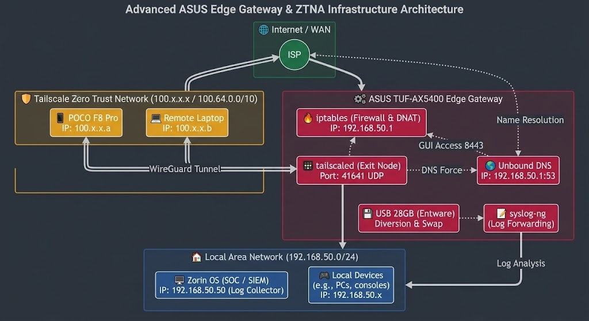

# Advanced ASUS Edge Gateway & ZTNA Infrastructure


---

## 📌 1. Overview & Project Goals

This repository documents a custom-configured, enterprise-grade network edge implementation running on consumer hardware. The solution transforms an **ASUS TUF-AX5400** router into a secure gateway featuring advanced routing, local recursive DNS resolution, automated log management, and secure zero-trust remote access via Tailscale.

**Author:** Wojciech Kołłątaj

---

## 🏗 2. Network Topology & Architecture

Below is the high-level architecture diagram illustrating the data flow, VPN encapsulation, local subnet segmentation, and external log shipping:



---

## ⚙️ 3. Hardware & Environment Specifications

| Component | Specification / Role |
| :--- | :--- |
| **Hardware** | ASUS TUF-AX5400 (ARM-based SoC, 512 MB RAM) |
| **Firmware** | Asuswrt-Merlin custom firmware |
| **Storage Expansion** | 28 GB USB 3.0 drive (`/dev/sda1` - *Entware_Storage*) |
| **Virtual Memory** | 2 GB Swap partition allocated on USB storage |
| **Package Management** | Entware environment hosted on external storage |

---

## 🛠 4. Core Services Stack

### 1. Tailscale ZTNA & Exit Node
* **Daemon:** `tailscaled` running in userspace networking mode via Entware.
* **Exit Node Role:** Advertises the local subnet (`192.168.50.0/24`) and acts as a secure cryptographic exit point for remote devices.
* **DNS Override Control:** Bypasses Tailscale's default DNS assignment (`--accept-dns=false`) to force all remote clients through the local resolver stack.

### 2. Local DNS Resolution (Unbound)
* **Resolver:** Full implementation of `unbound` daemon (`bind-dig`, `libunbound`).
* **Security & Performance:** Hardened against DNS Rebinding attacks, enabled query minimization (`qname-minimisation: yes`), and tuned with a strict memory cache profile optimized for embedded systems.

### 3. Traffic Management, Logging & SIEM
* **Diversion:** Integrated ad-blocking, log management, and rotation via scheduled cron tasks (`cru`).
* **SIEM Integration:** System and security logs are dynamically forwarded (`syslog-ng`) to an external workstation running analytical collectors.

---

## 📜 5. Initialization & Configuration Scripts (/jffs/scripts/)

The system relies on native custom hooks provided by Asuswrt-Merlin to guarantee proper service startup ordering and strict firewall enforcement upon boot.

### 🛡 Firewall & NAT Rules (/jffs/scripts/firewall-start)

```bash
#!/bin/sh
# Allow incoming traffic and forwarding through Tailscale interfaces
iptables -I INPUT -i tailscale+ -j ACCEPT
iptables -I FORWARD -i tailscale+ -j ACCEPT

# Expose router HTTPS management panel securely over Tailscale
# [SECURITY NOTE]: Ensure strict ACLs in Tailscale Admin Console to restrict access to port 8443!
iptables -t nat -I PREROUTING -i tailscale+ -p tcp --dport 8443 -j DNAT --to-destination 192.168.50.1:8443

# Force remote DNS queries originating from Tailscale clients to local Unbound resolver
iptables -I INPUT -i tailscale+ -p udp --dport 53 -j ACCEPT
iptables -I INPUT -i tailscale+ -p tcp --dport 53 -j ACCEPT
iptables -t nat -I PREROUTING -i tailscale+ -p udp --dport 53 -j DNAT --to-destination 192.168.50.1:53
iptables -t nat -I PREROUTING -i tailscale+ -p tcp --dport 53 -j DNAT --to-destination 192.168.50.1:53
```
### ⚙️ Services Initialization (/jffs/scripts/services-start)

```#!/bin/sh
# Wait for system environment and USB drives to be fully mounted
sleep 15

# Update and upgrade Tailscale via Entware
opkg update && opkg upgrade tailscale

# Start Tailscale daemon in userspace-networking mode
tailscaled -tun userspace-networking -state=/opt/var/lib/tailscale/tailscaled.st > /dev/null 2>&1 &
sleep 3

# Bring Tailscale up with specific routing and DNS rules
tailscale up --advertise-routes=192.168.50.0/24 --accept-dns=false --advertise-exit-node

# Ensure Unbound (local DNS resolver) is running (if managed by entware init)
/opt/etc/init.d/S61unbound start > /dev/null 2>&1 &

# Ensure syslog-ng (Log forwarding) is running (if managed by entware init)
/opt/etc/init.d/S58syslog-ng start > /dev/null 2>&1 &

# Diversion Log Rotation Scheduling
cru a Diversion_RotateLogs "20 18 * * * /bin/sh /opt/share/diversion/file/rotate-logs.div"
/bin/sh /opt/share/diversion/file/rotate-logs.div
cru a Diversion_RotateLogs "20 12 * * * /bin/sh /opt/share/diversion/file/rotate-logs.div"
```
## 🚀 6. Future Roadmap
Phase 2: Migration from embedded consumer hardware to a dedicated x86 edge gateway running OPNsense.

Phase 3: Native implementation of Suricata IDS/IPS and centralized logging via Wazuh agent integration.

## 📄 7. License
This project is open-source and available under the MIT License.
