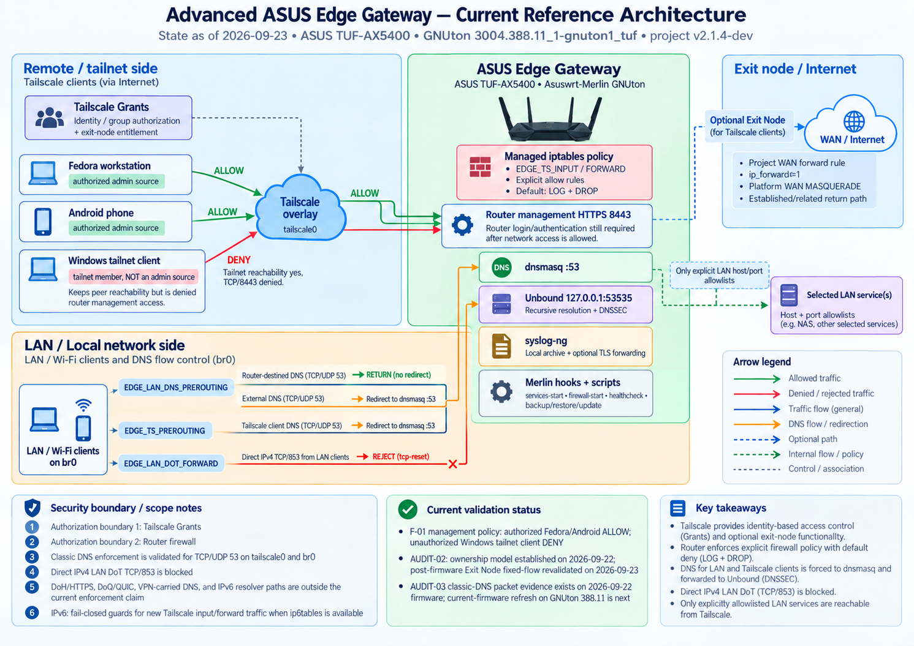

# Advanced ASUS Edge Gateway & Zero-Trust Lab

[](https://github.com/wojko6/Advanced-ASUS-Edge-Gateway-ZTNA-Infrastructure/actions/workflows/shellcheck.yml)

A reproducible Home/SMB security-edge lab for the ASUS TUF-AX5400. It combines Asuswrt-Merlin, Entware, Tailscale, Unbound, syslog-ng, and a least-privilege firewall policy.

This is an **enterprise-style lab**, not an enterprise-grade appliance. It has no high availability, redundant WAN, native VLAN microsegmentation, or vendor support.

## Portfolio highlights

- Built a consumer-router security edge with Tailscale identity, project-owned default-deny firewall chains, and explicit router/LAN allowlists.
- Integrated dnsmasq with local Unbound on loopback:53535 and validated DNSSEC with the AD flag after controlled reboots.
- Added install, backup, restore, uninstall, health-check, evidence-collection, WAN-event recovery, and rollback workflows.
- Migrated the persistent Entware environment from USB flash storage to SSD, restored swap-backed service startup, and directly validated SSD mounts, swap activation, Tailscale, Unbound, and resolver configuration after the controlled reboot.
- Captured sanitized live evidence instead of presenting expected behavior as observed results.

## Architecture



`docs/images/Architecture.png` is the canonical diagram for the current deployed/reference architecture. It reflects the live-validated LAN classic-DNS enforcement and direct DoT/853 blocking state; DoH/HTTPS 443 and DoQ/QUIC remain explicitly outside the current enforcement claim. Retired diagrams are kept out of the active documentation tree so readers do not have to choose between competing architecture views.

Remote access is enforced at two layers:

1. Tailscale Grants authorize identities and groups.
2. Managed iptables chains restrict router services, LAN destinations, ports, and optional exit-node forwarding.

See [architecture](docs/architecture.md), [firewall policy](docs/firewall-policy.md), and [security limitations](docs/security.md) for the detailed design.

## Key controls

- Project-owned Tailscale ingress chains are evaluated before competing parent rules and terminate in unconditional `DROP` for traffic arriving on `tailscale0` unless an explicit allow rule matches.
- Idempotent project-owned chains with duplicate jump removal.
- Device allowlist for router management and host/port allowlists for LAN access.
- Fail-closed IPv6 guards until an equivalent granular IPv6 policy is implemented.
- Classic DNS interception on TCP/UDP 53 through dnsmasq and Unbound.
- Bounded `/opt` readiness check and startup lock; no package upgrades during boot.
- Backup, dry-run restore, health checks, mock firewall tests, live tests, and CI.
- Sanitized evidence collection with explicit separation of automated and live results.
- Optional mutually authenticated TLS log forwarding with syslog-ng and reliable disk buffering.
- Automated collector retention that compresses completed logs after 24 hours and expires them after 30 days.

## Repository layout

```text
config/             Example runtime configuration and Tailscale policy
router/scripts/     Asuswrt-Merlin firewall-start and services-start hooks
scripts/            Install, update, health-check, backup, restore, uninstall
tests/              Static, mock-firewall, and live-client tests
docs/               Architecture, security, operations, testing, and roadmap
evidence/           Sanitized dated validation artifacts, evidence policy and templates
```

## Requirements

- ASUS router supported by Asuswrt-Merlin; reference device: TUF-AX5400.
- JFFS custom scripts enabled.
- Entware mounted at `/opt`.
- Tailscale and Unbound installed; syslog-ng is optional.
- A SHA-256 utility for verified backups; install Entware package `coreutils-sha256sum` when the firmware does not provide one.
- A working `flock` utility on the router PATH; `firewall-start` requires it to serialize concurrent policy rebuilds and fails closed if it is unavailable.
- A current router/JFFS backup and local recovery access for first deployment.

Entware package names can differ by target. Confirm them before installation:

```sh
opkg update
opkg list | grep -E '^(tailscale|unbound|syslog-ng|coreutils-sha256sum) '
```

Never commit auth keys, node state, private keys, collector credentials, router exports, or real private infrastructure data.

### Reference compatibility

The original 2026-09-11 SSD/reboot baseline used an ASUS TUF-AX5400 running ASUSWRT-Merlin 3004.388.9_2-gnuton1. The reference router was upgraded on 2026-09-23 to GNUton 3004.388.11_1-gnuton1_tuf; the [same-day worklog](docs/worklog/2026-09-23.md) records a subsequent reboot, clean project health and USB exposure audits, persisted admin firewall rules, and Fedora DNS/verified HTTPS smoke tests. These results do not establish universal firmware compatibility or long-term stability. Component compatibility is defined by tested behaviour: Tailscale must preserve the configured socket/routing and intentional `netfilter-mode=off` ownership model; Unbound must validate the deployed configuration and expose the configured loopback listener; syslog-ng remains optional unless remote logging is configured. Record actual material package versions in dated evidence after upgrades. See [compatibility and revalidation](docs/compatibility.md).

## Quick start

> **Reference-router stability observation:** the planned unchanged-state window was closed on **2026-09-22** after continuous 24/7 powered operation from **2026-09-11 through 2026-09-22**. This was not the originally planned full 14-day window through 2026-09-25, so the repository does not claim a completed 14-day endurance test. Subsequent router changes should still be performed as deliberate maintenance with backup, rollback and post-change validation. See [Stability observation](#stability-observation) and [Operations and recovery](docs/operations.md).

Prepare and validate the configuration on a Linux workstation working copy
with Python 3 available for the regression tests (not required on the router):

```sh
cp config/edge.conf.example config/edge.conf
vi config/edge.conf
chmod +x scripts/*.sh router/scripts/* tests/*.sh tests/mocks/*
sh tests/test-static.sh
```

Copy the repository to the router. Keep a LAN session open, then stage the integration without applying the firewall:

```sh
./scripts/install.sh
```

Authenticate the installed Tailscale instance once, using the socket configured in `config/edge.conf`:

```sh
tailscale --socket=/var/run/tailscale/tailscaled.sock up \
  --netfilter-mode=off \
  --accept-dns=false \
  --advertise-routes=192.168.50.0/24 \
  --advertise-exit-node
```

If exit-node mode is disabled in `config/edge.conf`, omit `--advertise-exit-node`. Approve only the required route or exit node in the Tailscale admin console and adapt `config/tailscale/policy.example.hujson` before publishing it.

ASUS Edge intentionally runs Tailscale with `netfilter-mode=off`. The project-owned
`EDGE_TS_*` chains enforce the router firewall policy instead of Tailscale-managed
`ts-input`, `ts-forward`, and `ts-postrouting` chains. Do not change this mode
without redesigning and revalidating the firewall policy.

Apply and validate from the LAN during a planned deployment or maintenance window:

```sh
./scripts/install.sh --apply
/jffs/addons/asus-edge/bin/healthcheck.sh
```

The installer backs up existing Merlin hooks but does not execute unreviewed legacy hooks by default. Set `EDGE_RUN_LEGACY_HOOKS="1"` only after confirming that the preserved scripts do not broaden access, upgrade packages during boot, or duplicate service startup. The installer does not install packages or update Tailscale.

## DNS integration

dnsmasq continues to own port 53 for LAN and `tailscale0`. Unbound listens on `127.0.0.1:53535`, and dnsmasq forwards queries to it. When Tailscale DNS interception is enabled, the active dnsmasq configuration must include `interface=tailscale0`.

For a standard Entware deployment:

```sh
cp config/unbound.conf.example /opt/etc/unbound/unbound.conf
unbound-checkconf /opt/etc/unbound/unbound.conf
```

For amtm Unbound Manager, do not overwrite its generated runtime file. Validate the manager-owned configuration instead. The restart command below is a maintenance action and should be used only during a planned maintenance window:

```sh
grep -E '^(port: 53535|interface: 127\.0\.0\.1@53535)' /opt/var/lib/unbound/unbound.conf
unbound-checkconf /opt/var/lib/unbound/unbound.conf
/opt/etc/init.d/S61unbound restart
```

Merge `config/dnsmasq.conf.add.example` with any existing `/jffs/configs/dnsmasq.conf.add`; do not overwrite private DDNS or local records. Review `/jffs/scripts/dnsmasq.postconf` for NextDNS or other hooks that may take precedence. Do not run a second resolver on `192.168.50.1:53` while dnsmasq owns that socket.

## DNS filtering validation

A controlled 2026-09-22 Diversion comparison tested `Standard + snbAdSupport=yes`, `Standard + snbAdSupport=no`, and `Large + snbAdSupport=no`. Disabling the SNBForums support exception measurably improved blocking, and the Large profile broadened DNS coverage, but representative sites still rendered advertising even while many observed ad-tech hostnames returned `NXDOMAIN` from the Android Tailscale exit-node client.

The current post-test state is `Large + snbAdSupport=no` with one focused denylist entry under normal-use observation. This is evidence that DNS filtering is useful but not equivalent to request-level/browser content blocking. Pi-hole remains a future observability and policy-management candidate, not a promise of complete visual-ad removal.

See [the sanitized Diversion validation](evidence/2026-09-22/diversion-ad-blocking-validation.md).

## Centralized logging

The optional logging design tails the firmware-owned `/tmp/syslog.log`, forwards it through Tailscale using mutually authenticated TLS, and can buffer messages on disk during collector outages. The checked-in examples require trusted peer certificates. Live mTLS delivery, buffer recovery, and post-reboot collector delivery should be described as observed only when the corresponding dated evidence exists; the presence of the example configuration alone is not operational proof.

See [centralized logging with mTLS](docs/centralized-logging.md) for the trust model, safe rollout order, negative certificate test, buffer recovery test, reboot validation, and evidence boundaries.

## Live validation status

The reference environment has multiple dated evidence sets. The **2026-09-11 SSD-migration/reboot artifact** directly validates the storage and core-service subset listed below; other firewall, printer, logging, health-check, and remote-client observations belong to their own dated evidence and must not be inferred from that single artifact.

Directly supported by `evidence/2026-09-11/entware-ssd-migration-validation.txt`:

- both SSD partitions mounted automatically after the controlled reboot;
- active 512 MiB and 2 GiB swap files;
- `tailscaled` running, with the Tailscale status command successful and the router offering exit-node capability;
- `unbound` running;
- direct Unbound resolution on `127.0.0.1:53535` returning `NOERROR` with the DNSSEC `AD` flag;
- dnsmasq configured with `no-resolv` and `server=127.0.0.1#53535`.

The artifact does **not** by itself prove syslog-ng recovery, end-to-end mTLS delivery, firewall/printer results, every exit-node traffic path, or long-term stability. See the sanitized [validated router-state snapshot](evidence/ROUTER-STATE-2026-09-11.md) for the exact claim boundary.

Other dated repository evidence documents additional validation performed in the reference environment, including remote-client DNS behavior and earlier router/firewall checks. Keep those observations attached to their original dates and artifacts rather than folding them into the 2026-09-11 SSD evidence.

On 2026-09-22, a separate live exit-node validation correlated the same fixed-ID ICMP flow on `tailscale0` before NAT and on the WAN interface after NAT. Together with `ip_forward=1`, the project WAN-forward rule, the Asuswrt-Merlin WAN `MASQUERADE`, and the parent established/related return rule, this validates the reference deployment's exit-node NAT boundary as **project-owned filtering + platform-owned WAN NAT**. See `evidence/2026-09-22/audit-02-exit-node-nat-validation.md`.

The 2026-09-08 LTE/5G validation observed behavior consistent with the intended remote DNS path:

`Android remote client -> Tailscale tunnel -> router dnsmasq/Diversion -> Unbound on loopback:53535 -> recursive DNS`

That historical result remains bounded to what was measured on that date. On **2026-09-22**, the previously unresolved Fedora/Android exit-node DNS datapath was re-tested with unique classic-DNS queries sent intentionally to an external resolver address. Read-only packet captures and `EDGE_TS_PREROUTING` counters validated UDP/53 and TCP/53 interception from Fedora, forwarding from dnsmasq to Unbound on `127.0.0.1:53535`, and equivalent controlled classic-DNS behavior from an Android client on LTE/5G with the ASUS selected as exit node.

The validated claim is intentionally limited to **classic DNS over UDP/TCP port 53**. It does not claim interception of DoH, DoT, QUIC-based encrypted DNS, or every application-specific resolver path.

See the [2026-09-22 AUDIT-03 DNS datapath validation](evidence/2026-09-22/audit-03-dns-datapath-validation.md), the [2026-09-08 live validation report](evidence/2026-09-08/live-validation.md), the [SSD migration procedure](docs/ENTWARE-SSD-MIGRATION.md), and the sanitized [2026-09-11 reboot validation evidence](evidence/2026-09-11/entware-ssd-migration-validation.txt).

## Stability observation

The unchanged-state observation was closed on **2026-09-22**. The reference router remained powered and in normal 24/7 operation from **2026-09-11 through 2026-09-22** without an intentional configuration-change cycle during that observation period. The originally planned end date was 2026-09-25, so this result must be described as the completed 2026-09-11 → 2026-09-22 continuous observation, **not** as a completed 14-day endurance test.

At the closing read-only check, the project health check reported `0 failure(s), 0 warning(s)` with `HEALTHCHECK_RC=0`; Entware/SSD storage, required swap, Tailscale, project firewall chains, Unbound/DNSSEC and syslog-ng were healthy, and the inspected syslog contained no matching OOM, crash, filesystem-I/O or read-only-filesystem errors.

Endpoint-filtering validation includes dated Zen evidence on Windows and a Fedora/GNOME proxy-integration case study. AdGuard for Windows remains an optional future comparison. These endpoint results remain separate from router-side capability claims.

## Validation and recovery

The commands below are operational examples. The unchanged-state observation is complete; install/uninstall/restore/firewall-apply actions and deliberate live-client policy tests should still be treated as planned maintenance with a current backup and rollback path.

Read-only router inspection during planned validation can include:

```sh
/jffs/addons/asus-edge/bin/healthcheck.sh
iptables -nvL EDGE_TS_INPUT
iptables -nvL EDGE_TS_FORWARD
iptables -t nat -nvL EDGE_TS_PREROUTING
```

The repository regression suite remains safe to run on a workstation working copy:

```sh
sh tests/test-static.sh
```

The live-client script actively probes management and LAN policy from an authorized remote client. Run it during a planned validation/maintenance window:

```sh
sh tests/test-live-client.sh 192.168.50.1 192.168.50.20
```

The second address is an optional LAN host on which SMB should be denied. See [testing](docs/testing.md) for the full security matrix and packet-capture procedure.

Collecting a new evidence snapshot executes the project's collector and should be treated as an explicit validation action:

```sh
/jffs/addons/asus-edge/bin/collect-evidence.sh
```

The collector excludes identity/configuration data and redacts firewall addresses, but its output still requires manual review before publication. This repository does not present expected behavior as observed live results. See [evidence collection](docs/evidence-collection.md) and the [validation evidence directory](evidence/README.md).

Backup and rollback commands for planned maintenance or recovery:

```sh
./scripts/backup.sh /opt/backups/asus-edge
./scripts/restore.sh /opt/backups/asus-edge/BACKUP.tar.gz --dry-run
./scripts/uninstall.sh
```

Tailscale updates are a separate planned-maintenance action:

```sh
./scripts/update-tailscale.sh
```

## Case studies

- [Case study index](docs/CASE-STUDIES.md) — troubleshooting and endpoint-integration investigations with explicit evidence, remediation, validation, and limitations.

## Documentation

- [Polski przewodnik wdrożenia](docs/deployment-pl.md)
- [Architecture](docs/architecture.md)
- [Firewall policy](docs/firewall-policy.md)
- [Security model and limitations](docs/security.md)
- [Threat model](docs/threat-model.md)
- [Testing strategy](docs/testing.md)
- [Evidence collection](docs/evidence-collection.md)
- [Endpoint filtering validation](docs/endpoint-filtering-validation.md)
- [Validated router-state snapshot](evidence/ROUTER-STATE-2026-09-11.md)
- [Centralized logging with mTLS](docs/centralized-logging.md)
- [Entware SSD migration](docs/ENTWARE-SSD-MIGRATION.md)
- [Printer hardening](docs/PRINTER-HARDENING.md)
- [uiDivStats high-load case study](docs/uidivstats-high-load-case-study.md)
- [Printer setup from LAN](docs/printer-setup-lan-pl.md)
- [Printer setup through Tailscale](docs/printer-setup-tailscale-pl.md)
- [Operations and recovery](docs/operations.md)
- [Roadmap](docs/roadmap.md)
- [Engineering worklog](docs/worklog/README.md)
- [Documentation model and source-of-truth rules](docs/documentation-model.md)
- [Compatibility and revalidation](docs/compatibility.md)

## Validation evidence

Sanitized evidence is stored under `evidence/YYYY-MM-DD/`. Each artifact should state what was actually observed and omit credentials, node state, real private addresses, or unrelated user data. Automated CI/mock output and live-router evidence are separate evidence classes; one must not be presented as proof of the other.

Automated shell, configuration, mock-firewall, recovery, and evidence-redaction tests run in GitHub Actions. Live network claims require separate dated evidence.

## Design principles

1. **Least privilege**: identities are filtered by Tailscale policy, then device IPs and destination ports are filtered again on the router.
2. **Fail closed**: invalid policy input aborts deployment; IPv6 is blocked until equivalent granular policy exists.
3. **Reproducible**: configuration templates, tests, rollback paths, and evidence procedures live with the code.
4. **Observable**: logs, counters, health checks, and sanitized evidence make policy behavior inspectable.
5. **Recoverable**: backups, dry-run restore, installer rollback, and LAN recovery procedures are documented and tested.
6. **Honest scope**: expected, automated, and live-validated behavior are kept separate, and platform limitations are explicit.

## License

See [LICENSE](LICENSE).
