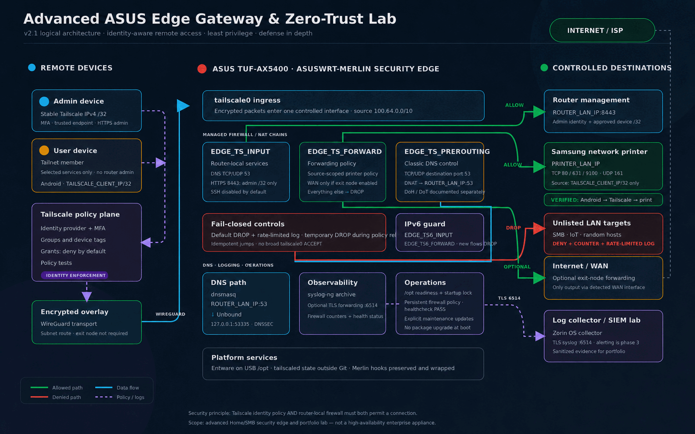

# Advanced ASUS Edge Gateway & Zero-Trust Lab

[](https://github.com/wojko6/Advanced-ASUS-Edge-Gateway-ZTNA-Infrastructure/actions/workflows/shellcheck.yml)

A reproducible Home/SMB security-edge lab for the ASUS TUF-AX5400. It combines Asuswrt-Merlin, Entware, Tailscale, Unbound, syslog-ng, and a least-privilege firewall policy.

This is an **enterprise-style lab**, not an enterprise-grade appliance. It has no high availability, redundant WAN, native VLAN microsegmentation, or vendor support.

## Architecture



Remote access is enforced at two layers:

1. Tailscale Grants authorize identities and groups.
2. Managed iptables chains restrict router services, LAN destinations, ports, and optional exit-node forwarding.

See [architecture](docs/architecture.md), [firewall policy](docs/firewall-policy.md), and [security limitations](docs/security.md) for the detailed design.

## Key controls

- Default-deny `INPUT` and `FORWARD` policy for traffic arriving on `tailscale0`.
- Idempotent project-owned chains with duplicate jump removal.
- Device allowlist for router management and host/port allowlists for LAN access.
- Fail-closed IPv6 guards until an equivalent granular IPv6 policy is implemented.
- Classic DNS interception on TCP/UDP 53 through dnsmasq and Unbound.
- Bounded `/opt` readiness check and startup lock; no package upgrades during boot.
- Backup, dry-run restore, health checks, mock firewall tests, live tests, and CI.
- Sanitized evidence collection with explicit separation of automated and live results.
- Optional TLS log forwarding with syslog-ng.

## Repository layout

```text
config/             Example runtime configuration and Tailscale policy
router/scripts/     Asuswrt-Merlin firewall-start and services-start hooks
scripts/            Install, update, health-check, backup, restore, uninstall
tests/              Static, mock-firewall, and live-client tests
docs/               Architecture, security, operations, testing, and roadmap
evidence/           Live-validation procedure and report template
```

## Requirements

- ASUS router supported by Asuswrt-Merlin; reference device: TUF-AX5400.
- JFFS custom scripts enabled.
- Entware mounted at `/opt`.
- Tailscale and Unbound installed; syslog-ng is optional.
- A SHA-256 utility for verified backups; install Entware package `coreutils-sha256sum` when the firmware does not provide one.
- A current router/JFFS backup and local recovery access for first deployment.

Entware package names can differ by target. Confirm them before installation:

```sh
opkg update
opkg list | grep -E '^(tailscale|unbound|syslog-ng|coreutils-sha256sum) '
```

Never commit auth keys, node state, private keys, collector credentials, router exports, or real private infrastructure data.

## Quick start

Prepare and validate the configuration on a working copy:

```sh
cp config/edge.conf.example config/edge.conf
vi config/edge.conf
chmod +x scripts/*.sh router/scripts/* tests/*.sh tests/mocks/*
sh tests/test-static.sh
```

Copy the repository to the router. Keep a LAN session open, then stage the integration without applying the firewall:

```sh
./scripts/install.sh
```

Authenticate the installed Tailscale instance once, using the socket configured in `config/edge.conf`:

```sh
tailscale --socket=/var/run/tailscale/tailscaled.sock up \
  --accept-dns=false \
  --advertise-routes=192.168.50.0/24 \
  --advertise-exit-node
```

If exit-node mode is disabled in `config/edge.conf`, omit `--advertise-exit-node`. Approve only the required route or exit node in the Tailscale admin console and adapt `config/tailscale/policy.example.hujson` before publishing it.

Apply and validate from the LAN:

```sh
./scripts/install.sh --apply
/jffs/addons/asus-edge/bin/healthcheck.sh
```

The installer backs up existing Merlin hooks but does not execute unreviewed legacy hooks by default. Set `EDGE_RUN_LEGACY_HOOKS="1"` only after confirming that the preserved scripts do not broaden access, upgrade packages during boot, or duplicate service startup. The installer does not install packages or update Tailscale.

## DNS integration

dnsmasq continues to own LAN port 53. Unbound listens on `127.0.0.1:53535`, and dnsmasq forwards queries to it.

For a standard Entware deployment:

```sh
cp config/unbound.conf.example /opt/etc/unbound/unbound.conf
unbound-checkconf /opt/etc/unbound/unbound.conf
```

For amtm Unbound Manager, do not overwrite its generated runtime file. Validate the manager-owned configuration instead:

```sh
grep -E '^(port: 53535|interface: 127\.0\.0\.1@53535)' /opt/var/lib/unbound/unbound.conf
unbound-checkconf /opt/var/lib/unbound/unbound.conf
/opt/etc/init.d/S61unbound restart
```

Merge `config/dnsmasq.conf.add.example` with any existing `/jffs/configs/dnsmasq.conf.add`; do not overwrite private DDNS or local records. Review `/jffs/scripts/dnsmasq.postconf` for NextDNS or other hooks that may take precedence. Do not run a second resolver on `192.168.50.1:53` while dnsmasq owns that socket.

## Validation and recovery

```sh
sh tests/test-static.sh
/jffs/addons/asus-edge/bin/healthcheck.sh
iptables -nvL EDGE_TS_INPUT
iptables -nvL EDGE_TS_FORWARD
iptables -t nat -nvL EDGE_TS_PREROUTING
```

From an authorized admin device, target the router's management address, normally `192.168.50.1`:

```sh
sh tests/test-live-client.sh 192.168.50.1 192.168.50.20
```

The second address is an optional LAN host on which SMB should be denied. See [testing](docs/testing.md) for the full security matrix and packet-capture procedure.

Collect a sanitized router-side evidence snapshot:

```sh
/jffs/addons/asus-edge/bin/collect-evidence.sh
```

The collector excludes identity/configuration data and redacts firewall addresses, but its output still requires manual review before publication. This repository does not present expected behavior as observed live results. See [evidence collection](docs/evidence-collection.md) and the [validation evidence directory](evidence/README.md).

Backup and rollback commands:

```sh
./scripts/backup.sh /opt/backups/asus-edge
./scripts/restore.sh /opt/backups/asus-edge/BACKUP.tar.gz --dry-run
./scripts/uninstall.sh
```

Tailscale updates are a separate maintenance action:

```sh
./scripts/update-tailscale.sh
```

## Documentation

- [Polski przewodnik wdrożenia](docs/deployment-pl.md)
- [Architecture](docs/architecture.md)
- [Firewall policy](docs/firewall-policy.md)
- [Security design and limitations](docs/security.md)
- [Threat model](docs/threat-model.md)
- [Testing and evidence collection](docs/testing.md)
- [Publishing validation evidence](docs/evidence-collection.md)
- [Operations and recovery](docs/operations.md)
- [Roadmap](docs/roadmap.md)

## License

MIT — see [LICENSE](LICENSE).
