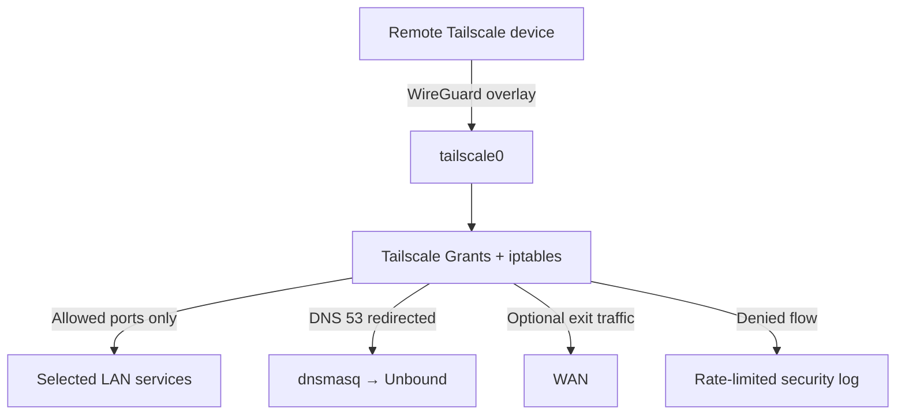

# Advanced ASUS Edge Gateway & Zero-Trust Lab

[](https://github.com/wojko6/Advanced-ASUS-Edge-Gateway-ZTNA-Infrastructure/actions/workflows/shellcheck.yml)

A reproducible Home/SMB security edge and network-security lab built on an ASUS TUF-AX5400 with Asuswrt-Merlin, Entware, Tailscale, Unbound, syslog-ng, and an explicit least-privilege firewall policy.

This repository is intentionally described as an **enterprise-style security lab**, not an enterprise-grade edge appliance. It demonstrates the engineering controls while documenting the limitations of consumer hardware: no high availability, limited resources, no native VLAN microsegmentation, and no redundant WAN.

## What changed in v2.0

- Configuration is now stored as auditable code instead of README snippets.
- Broad `INPUT` and `FORWARD` accepts from Tailscale were replaced by managed, default-deny chains.
- Firewall application is idempotent and removes duplicate jump rules.
- Package upgrades no longer run during boot.
- Service startup waits for `/opt` with a bounded readiness check and uses a lock.
- Existing Merlin hooks are preserved and wrapped during installation.
- Backup, verified dry-run restore, health checks, mock tests, live tests, threat modeling, and CI were added.
- A current Tailscale Grants policy example provides identity-level policy above the router firewall.

## Architecture



Detailed trust boundaries and data flows are in [docs/architecture.md](docs/architecture.md).

## Repository structure

```text
.
├── config/
│   ├── edge.conf.example
│   ├── dnsmasq.conf.add.example
│   ├── unbound.conf.example
│   ├── syslog-ng.conf.example
│   └── tailscale/policy.example.hujson
├── router/scripts/
│   ├── firewall-start
│   └── services-start
├── scripts/
│   ├── install.sh
│   ├── uninstall.sh
│   ├── backup.sh
│   ├── restore.sh
│   ├── healthcheck.sh
│   └── update-tailscale.sh
├── tests/
│   ├── test-static.sh
│   ├── test-firewall-mock.sh
│   └── test-live-client.sh
└── docs/
```

## Security model

The design uses two independent enforcement layers:

1. **Tailscale Grants** map identities/groups to destinations and ports. Tailscale policy is deny-by-default.
2. **Router iptables chains** enforce destination/port limits even if the tailnet policy is accidentally widened.

The local firewall cannot identify a Tailscale user. `EDGE_ADMIN_TS_SOURCES` therefore contains stable Tailscale device IPs/CIDRs, while the tailnet policy controls human identity and group membership. Both layers must allow the connection.

### Default access

| Source | Destination | Service | Default |
|---|---|---:|---|
| Tailscale | Router | DNS TCP/UDP 53 | Allow + redirect |
| Admin device list | Router | HTTPS 8443 | Allow |
| Admin device list | Router | SSH 22 | Deny |
| Tailscale | Listed LAN hosts | Listed ports | Allow |
| Tailscale | Other LAN targets | Any | Drop |
| Tailscale | Detected WAN interface | Any | Allow if exit node enabled |
| WAN | Router/LAN | Added by this project | None |

DNS interception covers classic port 53 only. DoH, DoT, DoQ, application-provided resolvers, and IPv6 require separate endpoint/network controls. See [docs/security.md](docs/security.md).

## Requirements

- ASUS router supported by Asuswrt-Merlin; reference device: TUF-AX5400.
- JFFS custom scripts enabled in the Merlin web interface.
- Entware mounted at `/opt`.
- Tailscale, Unbound, and optionally syslog-ng installed through Entware.
- A local recovery path (LAN cable or physical access) during first deployment.
- Current backups of router settings and JFFS.

Package names differ between Entware targets. Confirm them before installation:

```sh
opkg update
opkg list | grep -E '^(tailscale|unbound|syslog-ng) '
```

Do not put Tailscale auth keys, node state, private keys, collector credentials, or real email addresses into Git.

## Installation

Keep a LAN session open while testing the first policy.

```sh
cp config/edge.conf.example config/edge.conf
vi config/edge.conf
sh tests/test-static.sh
```

Copy the repository to the router, then stage the integration without applying the firewall:

```sh
chmod +x scripts/*.sh router/scripts/* tests/*.sh
./scripts/install.sh
```

Authenticate Tailscale interactively once. No auth key is stored by these scripts:

```sh
tailscale up --accept-dns=false --advertise-routes=192.168.50.0/24 --advertise-exit-node
```

Approve the subnet route/exit node in the Tailscale admin console and adapt `config/tailscale/policy.example.hujson`. Then apply and validate:

```sh
./scripts/install.sh --apply
/jffs/addons/asus-edge/bin/healthcheck.sh
```

The installer backs up and wraps existing `/jffs/scripts/firewall-start` and `services-start` hooks. It never installs packages and never upgrades Tailscale.

## DNS integration

On Asuswrt-Merlin, dnsmasq normally owns LAN port 53. This repository therefore runs Unbound on loopback port 53535 and forwards dnsmasq queries to it. Deploy the examples only after adapting paths and validating syntax:

```sh
cp config/unbound.conf.example /opt/etc/unbound/unbound.conf
cp config/dnsmasq.conf.add.example /jffs/configs/dnsmasq.conf.add
unbound-checkconf /opt/etc/unbound/unbound.conf
service restart_dnsmasq
```

Do not bind a second resolver directly to `192.168.50.1:53` while dnsmasq is using that socket.

## Validation

Run host-side checks before deployment:

```sh
sh tests/test-static.sh
```

Run router health checks after deployment:

```sh
/jffs/addons/asus-edge/bin/healthcheck.sh
iptables -nvL EDGE_TS_INPUT
iptables -nvL EDGE_TS_FORWARD
iptables -t nat -nvL EDGE_TS_PREROUTING
```

From an authorized remote client:

```sh
./tests/test-live-client.sh 100.x.y.z 192.168.50.20
```

For the capture plan, expected security matrix, and benchmark procedure, see [docs/testing.md](docs/testing.md).

## Operations and rollback

```sh
./scripts/backup.sh /opt/backups/asus-edge
./scripts/restore.sh /opt/backups/asus-edge/BACKUP.tar.gz --dry-run
./scripts/uninstall.sh
```

Backups intentionally exclude Tailscale authentication state. The uninstaller removes runtime chains and restores pre-existing Merlin hooks where available; it retains configuration and backups for manual review.

Tailscale updates are an explicit maintenance action:

```sh
./scripts/update-tailscale.sh
```

## Project scope and roadmap

This version demonstrates identity-aware remote access, subnet routing, optional exit-node routing, recursive DNS, centralized logging configuration, defense-in-depth firewalling, tests, and operations controls.

The next architecture phase moves enforcement to x86 OPNsense with VLANs, Suricata IDS/IPS, Wazuh/SIEM, metrics, configuration versioning, and tested recovery. See [docs/roadmap.md](docs/roadmap.md).

## Documentation

- [Polish deployment guide](docs/PRZEWODNIK-PL.md)
- [Architecture](docs/architecture.md)
- [Firewall policy](docs/firewall-policy.md)
- [Security design and limitations](docs/security.md)
- [Threat model](docs/threat-model.md)
- [Testing and evidence collection](docs/testing.md)
- [Operations and recovery](docs/operations.md)

## License

MIT — see [LICENSE](LICENSE).
