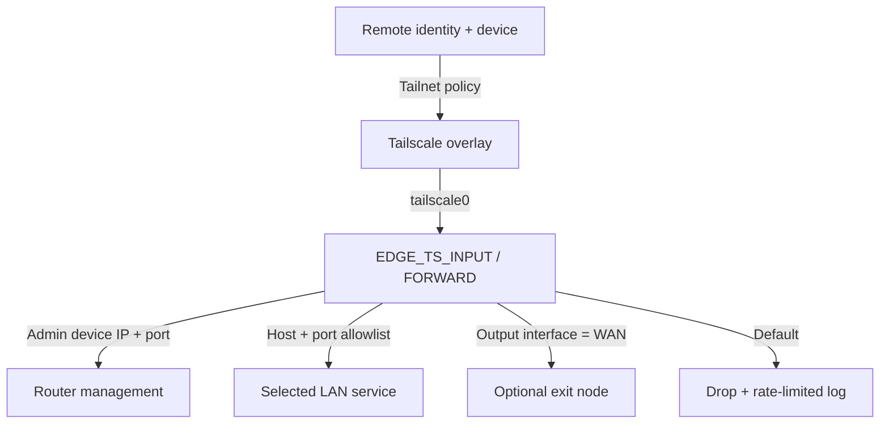
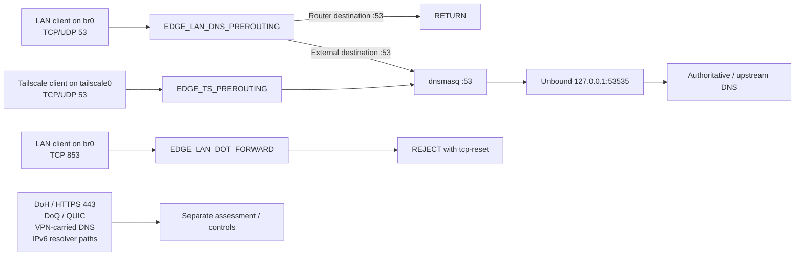
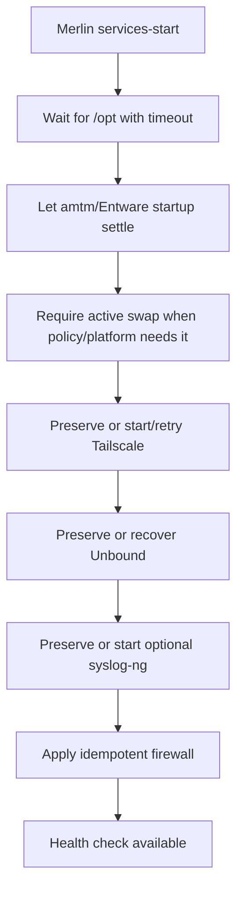

# Architecture

`images/Architecture.png` is the canonical topology diagram of the current reference deployment. Historical or proposed diagrams must be labeled explicitly and must not compete with this image as the active architecture view. Time-sensitive validation status is governed by [PROJECT-STATUS](../PROJECT-STATUS.md) and the dated evidence timeline. As of 2026-09-23, AUDIT-02 has been post-firmware live revalidated on GNUton `3004.388.11_1-gnuton1_tuf`; the equivalent current-firmware AUDIT-03 classic-DNS packet-correlation refresh remains the next datapath validation.

## Logical components

| Layer | Component | Responsibility |
|---|---|---|
| Identity/policy | Tailscale Grants | User/group/device authorization and exit-node entitlement |
| Overlay | Tailscale | Encrypted connectivity, subnet advertisement, optional exit routing |
| Local enforcement | iptables | Router service, LAN destination, port, and WAN-interface policy |
| DNS | dnsmasq + Unbound | Project-owned classic-DNS interception, LAN listener, recursive resolution, DNSSEC validation, cache |
| Observability | syslog-ng | Local archive and optional TLS forwarding |
| Operations | Merlin hooks + scripts | Deterministic startup, health checks, backup, restore, update |

## Trust boundaries and flows

Tailscale is the first authorization boundary. The router firewall is a second, independent boundary. Router login and service authentication remain required after network access is granted.

## DNS enforcement and resolver flow

Classic TCP/UDP port 53 is now enforced on both validated entry paths. Traffic arriving through `tailscale0` is redirected by `EDGE_TS_PREROUTING` to the router-local dnsmasq listener. Ordinary LAN/Wi-Fi traffic arriving on `br0` is handled by `EDGE_LAN_DNS_PREROUTING`: queries already addressed to the router on port 53 are returned to the normal local path, while client-selected external TCP/UDP 53 destinations are redirected to dnsmasq. dnsmasq then forwards to Unbound on `127.0.0.1:53535` for recursive resolution and DNSSEC validation.

The classic LAN enforcement path was deployed and live-validated on 2026-09-22 with `EDGE_ENFORCE_LAN_DNS=1`. Controlled Fedora UDP and TCP queries explicitly addressed to an external resolver traversed the normal LAN gateway and incremented the managed production redirect counters, while the post-change health check remained clean.

Direct IPv4 DNS-over-TLS from LAN clients is controlled separately. With `EDGE_BLOCK_LAN_DOT=1`, `EDGE_LAN_DOT_FORWARD` is evaluated for `br0` before platform FORWARD rules and rejects TCP/853 with `tcp-reset`. A controlled Fedora production test to `8.8.8.8:853` failed with `Connection refused` while the managed rule recorded the matching packet; the post-test health check remained at zero failures and zero warnings.

These controls do not create a universal encrypted-DNS boundary. DoH over HTTPS, DoQ/QUIC, VPN-carried DNS, IPv6 resolver paths, application-specific encrypted resolvers, and equivalent traffic entering through other interfaces require separate assessment and policy. In particular, `EDGE_LAN_DOT_FORWARD` is scoped to direct IPv4 LAN traffic on `br0`; it must not be described as a blanket DoT block for every possible client path.

The supplied IPv6 chains fail closed for new Tailscale input and forwarded traffic when `ip6tables` is available. If `ip6tables` is unavailable, the current scripts warn and the deployment must independently verify that IPv6 is disabled; the repository does not claim fail-closed IPv6 enforcement in that state. IPv6 access requires a separate granular policy and live validation before those guards are relaxed.

## Boot sequence

The project does not blindly restart all Entware services at boot. On the reference deployment, amtm owns the normal Entware startup path; ASUS Edge waits for that startup to settle, preserves services that are already stable, and performs bounded recovery only when required. `EDGE_RUN_RC_UNSLUNG=1` is an explicit alternative for deployments where no external hook owns `rc.unslung`.

On low-memory 32-bit systems with strict kernel overcommit, the startup path waits for active swap before launching the Go-based Tailscale daemon. Failed daemon starts are retried and propagated as a required-service failure without preventing the fail-closed firewall from being applied. Unbound is likewise preserved when stable and recovered directly only when needed; dnsmasq is restarted after successful Unbound recovery so the resolver chain returns to a known state. syslog-ng is optional and its absence does not make required service startup fail.

The startup path uses installed package versions. Package and Tailscale updates remain separate planned-maintenance operations and are not performed automatically during boot.
