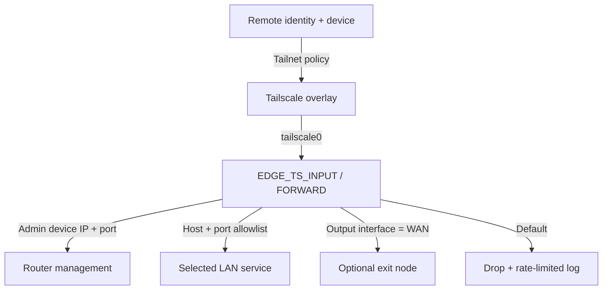
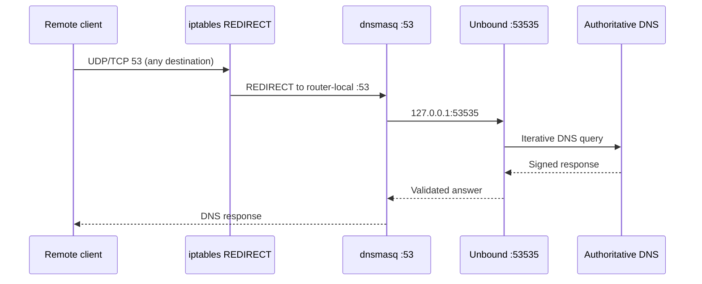
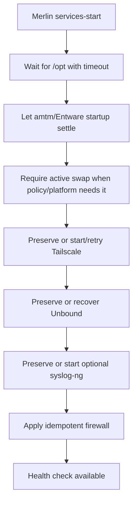

# Architecture

## Logical components

| Layer | Component | Responsibility |
|---|---|---|
| Identity/policy | Tailscale Grants | User/group/device authorization and exit-node entitlement |
| Overlay | Tailscale | Encrypted connectivity, subnet advertisement, optional exit routing |
| Local enforcement | iptables | Router service, LAN destination, port, and WAN-interface policy |
| DNS | dnsmasq + Unbound | LAN listener, recursive resolution, DNSSEC validation, cache |
| Observability | syslog-ng | Local archive and optional TLS forwarding |
| Operations | Merlin hooks + scripts | Deterministic startup, health checks, backup, restore, update |

## Trust boundaries and flows

Tailscale is the first authorization boundary. The router firewall is a second, independent boundary. Router login and service authentication remain required after network access is granted.

## DNS flow

Classic UDP/TCP port 53 arriving on `tailscale0` is redirected to the router-local DNS listener. The firewall uses the netfilter `REDIRECT` target rather than DNAT to a configured LAN address, so DNS interception remains bound to the receiving router even if its LAN IPv4 address changes. Encrypted DNS does not use this flow and is not intercepted.

The supplied IPv6 chains fail closed for new Tailscale input and forwarded traffic when `ip6tables` is available. If `ip6tables` is unavailable, the current scripts warn and the deployment must independently verify that IPv6 is disabled; the repository does not claim fail-closed IPv6 enforcement in that state. IPv6 access requires a separate granular policy and live validation before those guards are relaxed.

## Boot sequence

The project does not blindly restart all Entware services at boot. On the reference deployment, amtm owns the normal Entware startup path; ASUS Edge waits for that startup to settle, preserves services that are already stable, and performs bounded recovery only when required. `EDGE_RUN_RC_UNSLUNG=1` is an explicit alternative for deployments where no external hook owns `rc.unslung`.

On low-memory 32-bit systems with strict kernel overcommit, the startup path waits for active swap before launching the Go-based Tailscale daemon. Failed daemon starts are retried and propagated as a required-service failure without preventing the fail-closed firewall from being applied. Unbound is likewise preserved when stable and recovered directly only when needed; dnsmasq is restarted after successful Unbound recovery so the resolver chain returns to a known state. syslog-ng is optional and its absence does not make required service startup fail.

The startup path uses installed package versions. Package and Tailscale updates remain separate planned-maintenance operations and are not performed automatically during boot.
