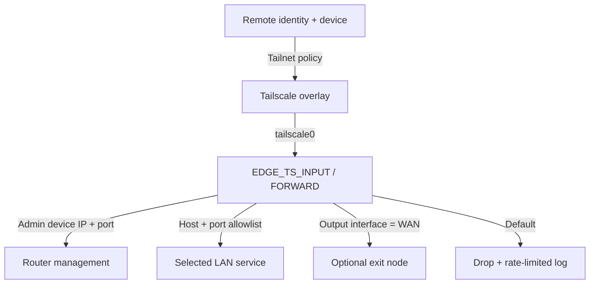
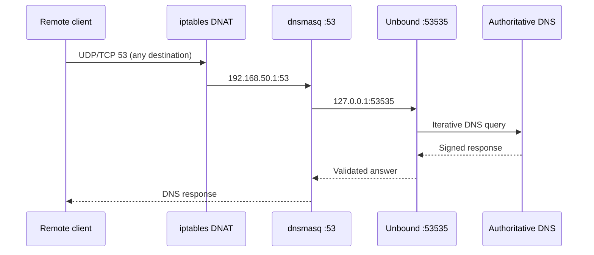
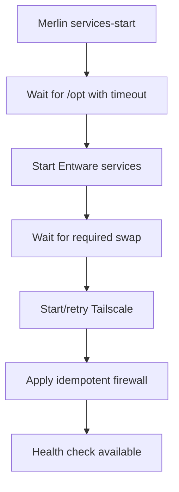

# Architecture

## Logical components

| Layer | Component | Responsibility |
|---|---|---|
| Identity/policy | Tailscale Grants | User/group/device authorization and exit-node entitlement |
| Overlay | Tailscale | Encrypted connectivity, subnet advertisement, optional exit routing |
| Local enforcement | iptables | Router service, LAN destination, port, and WAN-interface policy |
| DNS | dnsmasq + Unbound | LAN listener, recursive resolution, DNSSEC validation, cache |
| Observability | syslog-ng | Local archive and optional TLS forwarding |
| Operations | Merlin hooks + scripts | Deterministic startup, health checks, backup, restore, update |

## Trust boundaries and flows

Tailscale is the first authorization boundary. The router firewall is a second, independent boundary. Router login and service authentication remain required after network access is granted.

## DNS flow

Encrypted DNS does not use this flow and is not intercepted.

The supplied IPv6 chains fail closed for new Tailscale input and forwarded traffic. IPv6 access requires a separate granular policy and live validation before those guards are relaxed.

## Boot sequence

On low-memory 32-bit systems with strict kernel overcommit, the startup path
waits for active swap before launching the Go-based Tailscale daemon. Failed
daemon starts are retried and propagated as a required-service failure without
preventing the fail-closed firewall from being applied. The startup path uses
the installed package version; updates remain a separate maintenance operation.
