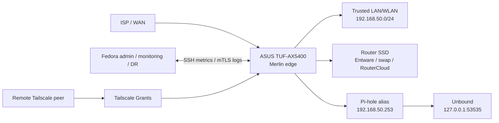
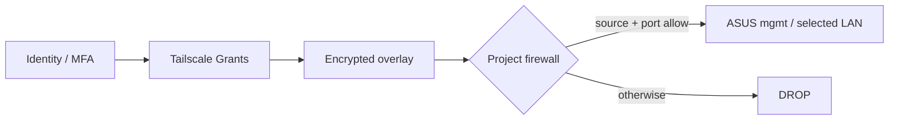
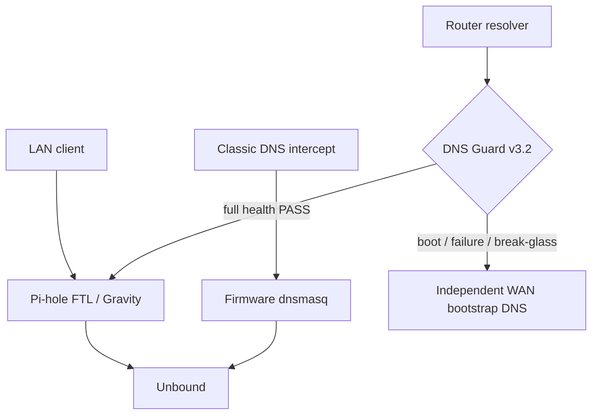
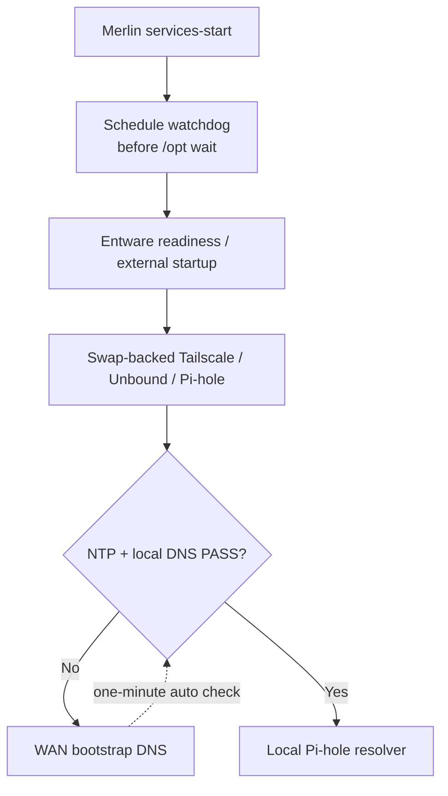
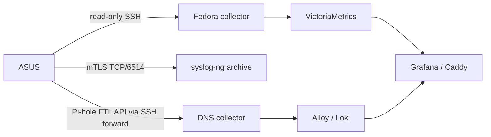

# ASUS Edge Gateway / ZTNA — architektura techniczna

**Status:** DATED SNAPSHOT / PORTFOLIO-SAFE  
**Stan referencyjny:** 2026-10-08  
**Platforma:** ASUS TUF-AX5400 / GNUton Asuswrt-Merlin 3004.388.11_1 + Fedora 44  
**Canonical source of truth:** [PROJECT-STATUS.md](../../PROJECT-STATUS.md) i [network-design index](../network-design.md)

> Przegląd architektury w danej dacie. Szczegółowe pliki Markdown, repozytoryjne
> testy i datowane dowody produkcyjne pozostają autorytatywne. Dokument nie jest
> pełnym prywatnym IPAM, instrukcją instalacji ani gwarancją HA.

## 1. Executive summary i sprzęt

To laboratorium Home/SMB klasy enterprise-style, nie infrastruktura
enterprise HA. Router realizuje forwarding, NAT, firewall i usługi
lokalne; Fedora jest administracyjnym hostem monitoringu, logowania i
DR. Router SSD jest wspólną domeną awarii Entware, swap i RouterCloud.
Brak redundantnego routera, ISP, niezależnego OOB i zwalidowanego UPS.

| Komponent | Rola | Stan |
|---|---|---|
| ASUS TUF-AX5400 (GNUton Merlin) | brama, DHCP, Tailscale, firewall, DNS | CURRENT |
| Router SSD | Entware, swap, dane RouterCloud | CURRENT / single failure domain |
| Fedora 44 | SSH admin, VictoriaMetrics, Grafana, Loki, DR | CURRENT |
| Pi-hole + Unbound | DNS filtering / upstream resolver | IMPLEMENTED |
| DNS Guard v3.2 | bootstrap, fail-open, sticky break-glass, watchdog | BOUNDED LIVE VALIDATED |
| Segmentacja Trusted/IoT/Guest | osobne strefy | PLANNED #143 |
| RT-BE88U | przyszły gateway | TARGET / requires revalidation |

## 2. Sieć i granice zaufania

`netfilter-mode=off` pozostawia lokalne reguły w gestii projektu.
Tailscale Grants sprawdzają tożsamość; `EDGE_TS_INPUT` i
`EDGE_TS_FORWARD` oddzielnie egzekwują ruch do routera i dalej do
LAN/Internetu. Projektowe ścieżki mają default DROP, a NAT WAN jest
platform-owned. Źródłowa allowlista dla exit-node forwarding nadal
wymaga issue #176. Zdalny management nie jest publikowany w WAN.

Main LAN ma `192.168.50.0/24`; adres routera `192.168.50.1`,
Pi-hole `192.168.50.253`, RouterCloud `192.168.50.254`.
Zarządzalne switche, FHRP, MLAG, STP-root design, 802.1X nie są
elementami aktualnej architektury. Native WAN IPv6 jest wyłączony
według zwalidowanego checkpointu; nie deklarujemy granularnych
IPv6 Tailscale allow rules.

## 3. DNS: trzy datapathy, nie jedna widoczność

- **Main-LAN DHCP -> Pi-hole -> Unbound:** filtrowanie Gravity/FTL
  przez adres aliasu; Pi-hole DHCP pozostaje wyłączony.
- **Classic DNS interception:** wymuszone UDP/TCP 53 może kończyć
  w firmware dnsmasq -> Unbound, a nie w Pi-hole. Historii Pi-hole
  nie można uznać za kompletną historię całego LAN/tailnet.
- **System resolver / exit-node DNS:** DNS Guard v3.2 utrzymuje
  niezależny WAN bootstrap DNS przy rozruchu i awarii lokalnego
  stosu; promuje Pi-hole dopiero po NTP, Unbound, FTL listenerze
  i funkcjonalnym zapytaniu. Ręczny sticky break-glass utrzymuje
  tryb awaryjny do jawnego wyłączenia.

Direct IPv4 LAN DoT na TCP/853 ma osobne ograniczenia; DoH/443,
DoQ/QUIC, VPN-carried DNS, application-specific encrypted DNS i
niezwalidowane IPv6 resolver paths pozostają poza uniwersalnym
DNS enforcement claim (issue #68).

## 4. Boot i mechanizmy odzyskiwania

Zależności obejmują swap przed cięższymi usługami Entware i
kontrolowane recovery Tailscale, Unbound oraz Pi-hole. Aktywny
`/jffs/scripts/services-start` planuje watchdog `AsusEdgeDNSGuard`
**przed** oczekiwaniem na `/opt`; `post-mount` odpowiada za
historycznie naprawioną aktywację swap przed startem Entware.
`wan-event-handler` ocenia bootstrap/local DNS przed recover Tailscale.

**Live 2026-10-08:** Fizyczny power-off/power-on z dostępnym Entware:
watchdog zaplanowany przy niesynchronizowanym czasie 01:00:40, USB
Entware zamontowany 01:00:44; przy ok. minucie router używał
zdrowego bootstrap DNS, a przy ok. dwóch minutach powrócił samoczynnie
do Pi-hole `192.168.50.253`. Końcowo `mode_local=1`,
`mode_bootstrap=0`, break-glass inactive, healthcheck
**0 failures / 0 warnings**.

**PR #197:** merged do `main` (commit
`01d6a7e00530ee8e9212820456047e2dee71a0a9`), ostatnie CI
4/4 PASS. Testy produkcyjne objęły ograniczone manualne ON/OFF
i cold boot **z Entware**. Nie objęły brakującego dysku Entware,
jednoczesnego blokowania lokalnego i bootstrap DNS, pełnej instalacji
PR ani dedykowanej telemetrii każdej fizycznej zmiany WAN.

## 5. Obserwowalność, logowanie i alerting

Live Grafana obsługuje loopback-first analitykę. FTL query history
jest prywatne: domeny, klienci i upstream nie są publikowane jako
publiczne dowody ani wysokokardynalne permanentne etykiety.

**15 reguł w YAML na 2026-10-08:** 5 infrastructure, 1 sustained
DNS Guard fail-open, 5 nowych recovery alerts (bootstrap unhealthy,
telemetry stale, UNKNOWN, watchdog missing, recovery flapping),
4 RouterCloud. Każda reguła konfiguruje istniejący receiver e-mail.
Pięć nowych UID i live DNS Guard metrics potwierdzono w Grafanie i
VictoriaMetrics. Nie przeprowadzono indywidualnego Firing/e-mail
acceptance dla nowych pięciu; issue #178 obejmuje grouping/escalation.

## 6. RouterCloud, backup i DR

RouterCloud jest dostępny tylko w LAN/Tailscale; pliki są przechowywane
na routerowym SSD. Ograniczony read-only SSH/rsync pobiera je na Fedorę,
a szyfrowany restic tworzy wersjonowane snapshoty na innym SSD.
Lokalny staging nie jest kopią zapasową. Projektowy DR wymaga również
natywnego eksportu Merlin, odtworzenia storage/Entware/swap i
zachowania prywatnego stanu uwierzytelniania Tailscale poza publicznym
archiwum. Pełny Pi-hole-aware rebuild contract to issue #129.

## 7. Ryzyka i roadmap

| Obszar | Status | Następna kontrola |
|---|---|---|
| DNS Guard v3.2 / cold boot z Entware | BOUNDED LIVE PASS | Nie przypisywać PASS scenariuszom awarii dysku |
| 15 alertów Grafany | SOURCE + 5 NEW LIVE LOADED | Indywidualne firing/delivery do rozważenia |
| Tailscale Grants + firewall | IMPLEMENTED | #176 exit-node local source scoping |
| Foldery backup/rollback | OPEN | #200 permissions/ownership |
| Pi-hole-aware disaster recovery | INCOMPLETE | #129 |
| Encrypted DNS universal block | NOT VALIDATED | #68 |
| IoT/Guest VLAN segmentation | PLANNED | #143 |
| Redundant WAN, gateway HA, UPS/OOB | NOT IMPLEMENTED / NOT VALIDATED | Rozważyć osobno |

## 8. Źródła / privacy boundary

- [Status projektu](../../PROJECT-STATUS.md)
- [Network design](../network-design.md)
- [DNS enforcement](dns-enforcement-flow.md)
- [Boot/service dependency](boot-service-dependency-flow.md)
- [Tailscale management](tailscale-management-exit-node-flow.md)
- [DNS Guard v3.2 live audit](../dns-guard-v3.2-recovery-audit-live-validation.md)
- [Historia v3.1](../case-studies/dns-bootstrap-deadlock-dns-guard-v3.1.md)
- [Monitoring](../../monitoring/README.md)
- [Documentation model](../documentation-model.md)

Dane publiczne nie zawierają haseł, tokenów, kluczy prywatnych,
publicznego WAN IP, MAC, indywidualnych Tailscale IP ani surowej
historii domowych zapytań DNS. Wewnętrzne adresy usług są ujawnione
jako świadomie przyjęty element topologii, a nie jako zgoda
na ich ekspozycję do Internetu.
