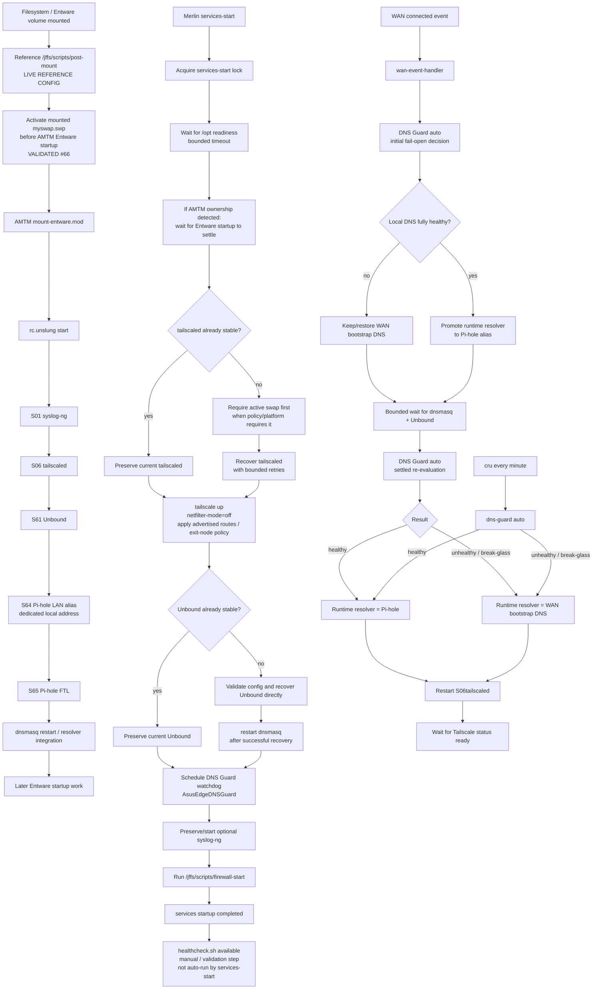

# Boot and Service Dependency Flow

## Purpose

This diagram distinguishes the **current reference router's validated live boot ordering** from the repository-managed services-start recovery logic. That distinction matters because the pre-Entware swap ordering correction recorded by #66 currently lives in the reference router's /jffs/scripts/post-mount rather than in a repository-managed post-mount hook.

## Validated scope and limitations

- The 2026-09-27 #66 evidence found that the original reference post-mount order could start Entware services before its AMTM-added swapon line was reached.
- The reference router was corrected so the mounted volume's swap is activated **before** sourcing AMTM mount-entware.mod. Three fresh clean cycles then passed with no recurring dnsmasq ENOMEM event.
- During the 2026-09-28 Pi-hole cleanup, a later `post-mount` revision was found to have lost the actual `swapon` action while retaining only the state check. The resulting reboot left swap inactive and Tailscale failed with a Go-runtime heap-allocation OOM. Explicit per-volume `swapon` was restored before AMTM startup, and the next clean reboot returned both swap files, Tailscale, the Pi-hole alias, FTL and Unbound automatically.
- The Pi-hole alias init script is ordered immediately before the FTL init script so the dedicated listener address exists before FTL binds TCP/UDP 53.
- This pre-Entware post-mount correction is **validated live reference configuration**, but it is not presently installed or owned by the repository's services-start script. If AMTM rewrites post-mount, this ownership boundary must be rechecked.
- services-start waits for /opt, detects AMTM ownership, lets the external Entware startup settle, and preserves already-stable services where possible.
- If tailscaled is not already stable, the repository's recovery path checks required swap **before** launching the Go daemon. Stable tailscaled processes are preserved without taking that recovery path.
- EDGE_RUN_RC_UNSLUNG=1 is an explicit alternative for deployments where no external hook owns rc.unslung; the reference configuration keeps it disabled because AMTM owns normal Entware startup.
- Unbound is preserved if stable. Direct recovery validates the configuration and restarts dnsmasq only after a successful recovery.
- syslog-ng is optional in services-start.
- firewall-start is required. Required service/firewall failures cause services-start to exit non-zero.
- healthcheck.sh is an explicit validation tool; services-start does not automatically invoke it.
- wan-event-handler is a separate WAN-connected recovery path. It delegates resolver selection to DNS Guard instead of hard-coding `127.0.0.1`: the initial pass fails open to WAN bootstrap DNS when the local stack is not yet healthy, a bounded wait gives dnsmasq/Unbound time to settle, and a second DNS Guard pass promotes the runtime resolver to Pi-hole only when the full local path is ready. Tailscale is restarted only after the resolver policy step.
- services-start recreates the named `AsusEdgeDNSGuard` cron watchdog. The watchdog re-evaluates the same policy once per minute and keeps sticky break-glass priority over automatic Pi-hole promotion.
- The 2026-10-06 full cold-boot validation returned NTP, Unbound, Pi-hole, Tailscale, the DNS Guard watchdog and the Pi-hole steady-state runtime resolver without reproducing the earlier DNS/NTP/Unbound dependency cycle.

## Traceability

- [router/scripts/services-start](../../router/scripts/services-start)
- [router/scripts/wan-event-handler](../../router/scripts/wan-event-handler)
- [router/scripts/firewall-start](../../router/scripts/firewall-start)
- [config/edge.conf.example](../../config/edge.conf.example)
- [Clean startup and persistence evidence — 2026-09-27](../../evidence/2026-09-27/issue-66-clean-startup-persistence-evidence.md)
- [Pi-hole main-LAN cutover and final reboot evidence — 2026-09-28](../../evidence/2026-09-28/pi-hole-main-lan-cutover-validation.md)
- [DNS Guard v3.1 production validation — 2026-10-06](../../evidence/2026-10-06/dns-guard-v3.1-production-validation.md)
- [DNS bootstrap deadlock and fail-open resolver recovery](../dns-guard-cold-boot-case-study.md)
