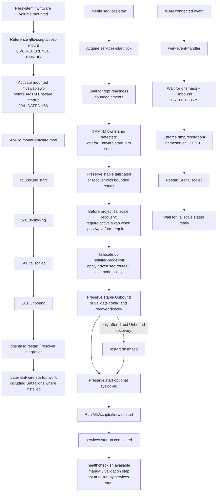

# Boot and Service Dependency Flow

## Purpose

This diagram distinguishes the **current reference router's validated live boot ordering** from the repository-managed services-start recovery logic. That distinction matters because the pre-Entware swap ordering correction recorded by #66 currently lives in the reference router's /jffs/scripts/post-mount rather than in a repository-managed post-mount hook.

## Validated scope and limitations

- The 2026-09-27 #66 evidence found that the original reference post-mount order could start Entware services before its AMTM-added swapon line was reached.
- The reference router was corrected so the mounted volume's swap is activated **before** sourcing AMTM mount-entware.mod. Three fresh clean cycles then passed with no recurring dnsmasq ENOMEM event.
- This pre-Entware post-mount correction is **validated live reference configuration**, but it is not presently installed or owned by the repository's services-start script. If AMTM rewrites post-mount, this ownership boundary must be rechecked.
- services-start waits for /opt, detects AMTM ownership, lets the external Entware startup settle, and preserves already-stable services where possible.
- The repository's own swap guard is specifically before Tailscale recovery on platforms/policies that require swap; it does not replace the live reference pre-Entware post-mount ordering correction.
- Unbound is preserved if stable. Direct recovery validates the configuration and restarts dnsmasq only after a successful recovery.
- syslog-ng is optional in services-start.
- firewall-start is required. Required service/firewall failures cause services-start to exit non-zero.
- healthcheck.sh is an explicit validation tool; services-start does not automatically invoke it.
- wan-event-handler is a separate WAN-connected recovery path. It waits for the local DNS path, points the system resolver at 127.0.0.1, restarts the Entware Tailscale service and waits for the local Tailscale API to become ready.

## Traceability

- [router/scripts/services-start](../../router/scripts/services-start)
- [router/scripts/wan-event-handler](../../router/scripts/wan-event-handler)
- [router/scripts/firewall-start](../../router/scripts/firewall-start)
- [config/edge.conf.example](../../config/edge.conf.example)
- [Clean startup and persistence evidence — 2026-09-27](../../evidence/2026-09-27/issue-66-clean-startup-persistence-evidence.md)
