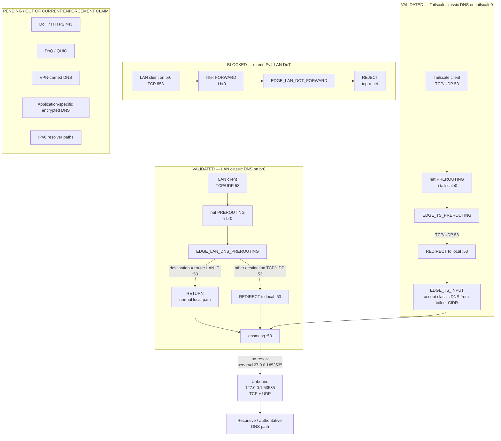

# DNS Enforcement Flow

## Purpose

This is the canonical DNS-policy diagram for the current reference deployment. It shows the validated classic IPv4 DNS paths separately for LAN/br0 and Tailscale/tailscale0, plus the narrower direct LAN DoT control and the transports that remain outside the present enforcement claim.

## Validated scope and limitations

- **LAN/br0 classic DNS:** when EDGE_ENFORCE_LAN_DNS=1, queries already addressed to the router on TCP/UDP 53 RETURN to the normal local path; client-selected external TCP/UDP 53 destinations are REDIRECTed to local port 53.
- **Tailscale/tailscale0 classic DNS:** when EDGE_INTERCEPT_DNS=1, EDGE_TS_PREROUTING REDIRECTs TCP/UDP 53 to local port 53. EDGE_TS_INPUT then permits classic DNS from the configured tailnet IPv4 CIDR.
- **Resolver chain:** dnsmasq owns port 53 and forwards ordinary queries to Unbound on 127.0.0.1:53535. The reference Unbound listener is loopback-only and supports TCP and UDP.
- **Direct LAN DoT:** when EDGE_BLOCK_LAN_DOT=1, EDGE_LAN_DOT_FORWARD rejects direct IPv4 TCP/853 traffic arriving on br0 with tcp-reset.
- The DoT rule is **not** a universal DoT control. It does not claim equivalent enforcement for Tailscale, other ingress interfaces, tunnels, or IPv6.
- DoH/HTTPS 443, DoQ/QUIC, VPN-carried DNS, application-specific encrypted resolvers and IPv6 resolver paths remain separate assessment items. No universal encrypted-DNS enforcement is claimed.

## Current-firmware validation

The current reference firmware classic-DNS datapath was revalidated on 2026-09-27. The controlled Fedora test established the tested path:

Fedora → Tailscale exit-node path → tailscale0 → EDGE_TS_PREROUTING → REDIRECT :53 → dnsmasq :53 → Unbound 127.0.0.1:53535.

Both UDP/53 and TCP/53 showed exact +1 managed REDIRECT counter deltas and matching dnsmasq-to-Unbound loopback traffic in the controlled window.

A same-day #65 acceptance check also reconfirmed representative LAN and Android-over-Tailscale classic-DNS functionality after the Diversion Large refresh.

## Traceability

- [router/scripts/firewall-start](../../router/scripts/firewall-start)
- [config/dnsmasq.conf.add.example](../../config/dnsmasq.conf.add.example)
- [config/unbound.conf.example](../../config/unbound.conf.example)
- [AUDIT-03 current-firmware DNS datapath revalidation — 2026-09-27](../../evidence/2026-09-27/audit-03-current-firmware-dns-datapath-revalidation.md)
- [Diversion Large normal-use acceptance — 2026-09-27](../../evidence/2026-09-27/issue-65-diversion-large-normal-use-acceptance.md)
