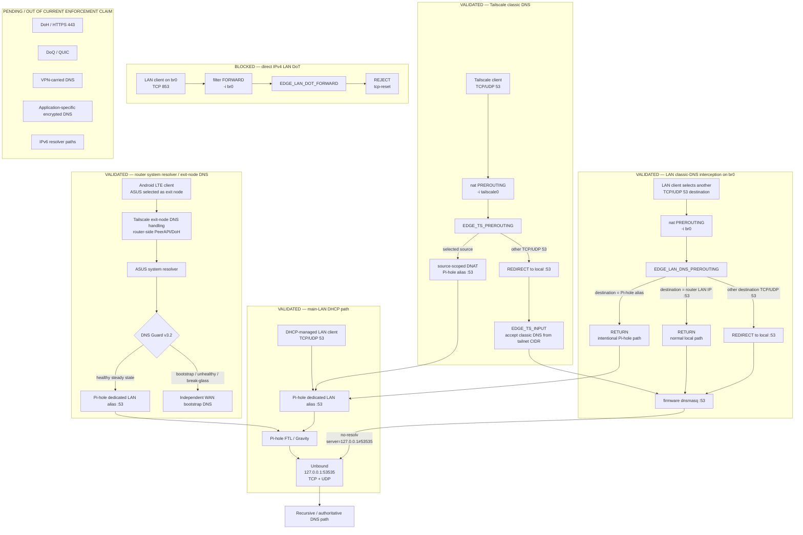

# DNS Enforcement Flow

## Purpose

This is the canonical DNS-policy diagram for the current reference deployment.
It separates the **Pi-hole-filtered main-LAN DHCP path** from the existing
project classic-DNS interception paths, plus the separately validated router
system-resolver path used by Tailscale exit-node DNS. It also keeps the direct
LAN DoT control and out-of-scope encrypted-DNS transports explicit.



## Validated scope and limitations

- **Main-LAN DHCP DNS:** the 2026-09-28 cutover advertises only the dedicated
  Pi-hole listener to the tested main-LAN DHCP client. Pi-hole forwards allowed
  external queries to Unbound on `127.0.0.1:53535`.
- **Local naming:** Pi-hole DHCP remains disabled. Conditional reverse DNS uses
  firmware dnsmasq as the local naming source; a post-reboot active lease
  returned the same local hostname through both resolvers.
- **LAN/br0 classic DNS enforcement:** when `EDGE_ENFORCE_LAN_DNS=1`, traffic
  intentionally addressed to the configured Pi-hole alias is allowed to reach
  Pi-hole. Other external TCP/UDP 53 destinations are redirected to the router
  local port 53 and therefore terminate at firmware dnsmasq before Unbound.
- **Tailscale/tailscale0 classic DNS:** the generic
  `EDGE_TS_PREROUTING` fallback still terminates at firmware dnsmasq. An
  optional source-scoped policy can place selected Tailscale IPv4 clients
  through the dedicated Pi-hole listener first, using DNAT rules ordered
  before the generic REDIRECT. Pi-hole filtering for that optional path is
  claimed only after client-specific live validation.
- **Resolver chain:** both Pi-hole and firmware dnsmasq use Unbound on
  `127.0.0.1:53535` for ordinary external resolution.
- **Router system resolver / exit-node DNS:** DNS Guard v3.2 keeps independent
  WAN DNS for bootstrap/fail-open states and promotes the router runtime
  resolver to the dedicated Pi-hole alias only after NTP, Unbound, Pi-hole
  listener and functional-query checks pass. A 2026-10-06 Android LTE test with
  the ASUS selected as exit node captured the unique query from the router
  system resolver to Pi-hole on loopback and the successful Pi-hole answer.
  This path is distinct from the generic `tailscale0` classic-DNS REDIRECT
  path and does not preserve the original Android source identity at Pi-hole.
- **Direct LAN DoT:** when `EDGE_BLOCK_LAN_DOT=1`,
  `EDGE_LAN_DOT_FORWARD` rejects direct IPv4 TCP/853 traffic arriving on
  `br0` with tcp-reset.
- The DoT rule is **not** a universal DoT control. It does not claim equivalent
  enforcement for Tailscale, other ingress interfaces, tunnels or IPv6.
- DoH/HTTPS 443, DoQ/QUIC, VPN-carried DNS, application-specific encrypted
  resolvers and IPv6 resolver paths remain separate assessment items.

## DNS analytics visibility boundary

Issue #108 builds analytics from the query history already recorded by Pi-hole
FTL for the validated DHCP-managed main-LAN path. That is an observability
overlay, not a change to the resolver datapath shown above.

The live Grafana dashboard therefore describes its dataset as
**Pi-hole-visible DNS activity**. Queries redirected to firmware dnsmasq and
encrypted-DNS traffic that bypasses the local resolver are not automatically
present in that dataset.

The Tailscale boundary is now directly demonstrated: a controlled classic-DNS
query with Tailscale active was captured on `tailscale0` but absent from
Pi-hole RAM/disk history and the Fedora collector. With Tailscale disabled, the
same controlled client was visible through the ordinary main-LAN Pi-hole path.
The hard-coded external LAN interception path remains to be correlated
separately.

Broad dnsmasq query logging is not enabled merely to duplicate Pi-hole history.

See [Network DNS Visibility / Client Activity Analytics](../network-dns-visibility-client-activity-analytics.md).

## 2026-10-08 current recovery policy: DNS Guard v3.2

The diagram above reflects the current v3.2 policy merged in
[PR #197](https://github.com/wojko6/Advanced-ASUS-Edge-Gateway-ZTNA-Infrastructure/pull/197).
Manual sticky break-glass ON/OFF passed in a bounded production
deployment. In the 2026-10-08 physical cold boot **with Entware present**,
the watchdog registered before the Entware mount and the router returned
automatically from independent WAN bootstrap DNS to Pi-hole.

The v3.1 dated test below remains **historical**, not v3.2 coverage.
Missing Entware, dual local/bootstrap failure injection and complete
installer deployment remain outside the v3.2 live acceptance.
See [v3.2 live validation](../dns-guard-v3.2-recovery-audit-live-validation.md).

## 2026-10-06 DNS Guard and exit-node DNS validation

The router's system resolver now follows a two-phase DNS Guard v3.1 policy:

```text
BOOTSTRAP / LOCAL DNS FAILURE / BREAK-GLASS
router -> independent WAN DNS

HEALTHY STEADY STATE
router -> Pi-hole -> Unbound
```

This prevents the cold-boot dependency cycle discovered when the router was
persistently pointed at Pi-hole before Unbound could start behind NTP readiness.

After full reboot, Android LTE with the ASUS selected as Tailscale exit node
resolved a fresh unique hostname successfully. Capture on `any` showed the
router-local query on loopback:

```text
192.168.50.1 -> 192.168.50.253:53
A? exitdns-final-<timestamp>.1-1-1-1.sslip.io

192.168.50.253:53 -> 192.168.50.1
A 1.1.1.1
```

See
[DNS Guard v3.1 production validation](../../evidence/2026-10-06/dns-guard-v3.1-production-validation.md).

## 2026-09-28 Pi-hole cutover validation

The reference main LAN completed a staged Pi-hole migration:

- dedicated Pi-hole listener and FTL persistence passed;
- OISD source/Gravity parity was measured;
- main-LAN DHCP was changed to advertise only Pi-hole;
- reverse DNS was validated through firmware dnsmasq for an active lease;
- Diversion, uiDivStats, Stubby and an inactive NextDNS hook were removed;
- an intermediate reboot exposed missing swap activation and a Tailscale
  Go-runtime OOM;
- pre-Entware swap activation was restored;
- the final reboot returned swap, Tailscale, Pi-hole, Unbound and DHCP DNS
  automatically.

See the [final case study](../pi-hole-on-router-case-study.md) and
[sanitized cutover evidence](../../evidence/2026-09-28/pi-hole-main-lan-cutover-validation.md).

## Historical current-firmware interception evidence

The classic-DNS interception datapath itself was revalidated on 2026-09-27.
The controlled Fedora test established the tested historical path:

Fedora → Tailscale exit-node path → tailscale0 → EDGE_TS_PREROUTING →
REDIRECT :53 → firmware dnsmasq :53 → Unbound 127.0.0.1:53535.

Both UDP/53 and TCP/53 showed exact +1 managed REDIRECT counter deltas and
matching dnsmasq-to-Unbound loopback traffic in the controlled window.

That evidence remains valid for the tested interception mechanism, but it is not
evidence that the path now traverses Pi-hole.

## Traceability

- [router/scripts/firewall-start](../../router/scripts/firewall-start)
- [config/dnsmasq.conf.add.example](../../config/dnsmasq.conf.add.example)
- [config/unbound.conf.example](../../config/unbound.conf.example)
- [AUDIT-03 current-firmware DNS datapath revalidation — 2026-09-27](../../evidence/2026-09-27/audit-03-current-firmware-dns-datapath-revalidation.md)
- [Pi-hole single-client pilot — 2026-09-28](../../evidence/2026-09-28/pi-hole-single-client-pilot-validation.md)
- [Pi-hole main-LAN cutover — 2026-09-28](../../evidence/2026-09-28/pi-hole-main-lan-cutover-validation.md)
- [Android Pi-hole/Tailscale source-scoped validation — 2026-10-06](../../evidence/2026-10-06/issue-152-android-pihole-tailscale-validation.md)
- [DNS Guard v3.1 production validation — 2026-10-06](../../evidence/2026-10-06/dns-guard-v3.1-production-validation.md)
