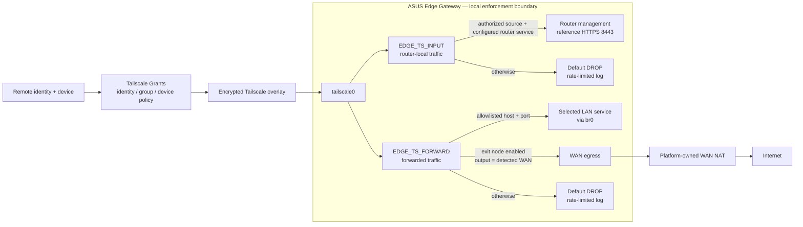

# High-Level Architecture and Trust Boundaries

## Purpose

This diagram is the canonical high-level view of the current ASUS Edge Gateway reference design. It separates Tailscale identity/policy from the project-owned local firewall and shows the three intended traffic classes without merging their detailed datapaths.

## Validated scope and limitations

- **Tailscale Grants** are the first authorization boundary. The router firewall is a second, independent boundary.
- Tailscale runs with **netfilter-mode=off** in this design; ASUS Edge owns the EDGE_TS_* iptables policy.
- EDGE_TS_INPUT and EDGE_TS_FORWARD are attached ahead of competing parent rules for traffic arriving on tailscale0 and terminate in unconditional DROP after explicit allow rules.
- Router service authentication still applies after network access is allowed.
- The exit-node path uses project-owned forwarding policy but **platform-owned WAN NAT**; the project does not create a separate exit-node MASQUERADE rule.
- The current repository also installs fail-closed IPv6 Tailscale INPUT/FORWARD guards when ip6tables is available. Granular IPv6 allow policy is not claimed.
- DNS interception is intentionally omitted from this high-level drawing. See [DNS Enforcement Flow](dns-enforcement-flow.md).
- Exact management DNAT and exit-node forwarding behavior is shown in [Tailscale Management and Exit-Node Flow](tailscale-management-exit-node-flow.md).

## Traceability

Primary implementation sources:

- [router/scripts/firewall-start](../../router/scripts/firewall-start)
- [config/edge.conf.example](../../config/edge.conf.example)
- [config/tailscale/policy.example.hujson](../../config/tailscale/policy.example.hujson)

Relevant live evidence:

- [Unauthorized tailnet management denial — 2026-09-23](../../evidence/2026-09-23/unauthorized-tailnet-management-denial.md)
- [Post-firmware exit-node revalidation — 2026-09-23](../../evidence/2026-09-23/audit-02-post-firmware-exit-node-revalidation.md)
