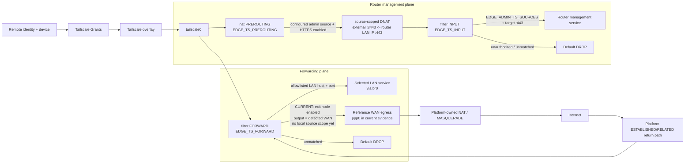

# Tailscale Management and Exit-Node Flow

## Purpose

This diagram separates Tailscale router-management traffic, selected LAN forwarding and exit-node forwarding. DNS interception is deliberately excluded so that management and forwarding claims are not visually conflated with the resolver path.

## Validated scope and limitations

- Tailscale is configured with **netfilter-mode=off**; project-owned EDGE_TS_* chains provide local firewall enforcement.
- Router-management access is source-scoped. In the reference policy, authorized Tailscale clients use external TCP/8443 while the ASUS httpds target listener is TCP/443; router SSH is disabled.
- The HTTPS management DNAT rule in EDGE_TS_PREROUTING is created only for configured admin Tailscale sources and translates the external port to the configured target listener. EDGE_TS_INPUT independently requires the allowed source plus the post-DNAT destination/target port, then ends in DROP. The healthcheck also verifies that the target listener actually exists.
- A 2026-09-23 negative test confirmed that a distinct tailnet client outside the admin source set retained peer reachability but could not establish TCP/8443 management access.
- EDGE_TS_FORWARD permits only explicit selected-LAN rules plus the optional exit-node rule to the detected WAN interface; unmatched forwarded traffic reaches the default DROP.
- The current exit-node rule is **not yet router-locally source-scoped**. Tailscale Grants remain the identity/entitlement boundary, while the local firewall currently accepts exit-node forwarding based on ingress `tailscale0`, exit-node enablement and detected WAN egress. Issue #176 tracks an independent `EDGE_EXIT_TS_SOURCES`-style allowlist so the local firewall can fail closed for unlisted tailnet sources.
- Exit-node source NAT is **platform-owned**. Current-firmware live evidence correlated the Tailscale-side flow with ppp0 egress after platform source translation.
- Return traffic relies on the platform established/related path and the EDGE_TS_FORWARD ESTABLISHED,RELATED rule.
- DNS interception is documented separately in [DNS Enforcement Flow](dns-enforcement-flow.md).
- The reference router's current live Tailscale runtime is 1.103.375 on the unstable/dev track. The forwarding model remains `netfilter-mode=off`; the runtime upgrade did not change firewall ownership.

## Traceability

- [router/scripts/firewall-start](../../router/scripts/firewall-start)
- [config/edge.conf.example](../../config/edge.conf.example)
- [Unauthorized tailnet management denial — 2026-09-23](../../evidence/2026-09-23/unauthorized-tailnet-management-denial.md)
- [Post-firmware exit-node revalidation — 2026-09-23](../../evidence/2026-09-23/audit-02-post-firmware-exit-node-revalidation.md)
- [Android exit-node public-IP validation — 2026-09-27](../../evidence/2026-09-27/issue-67-android-exit-node-public-ip-validation.md)
- [Android Pi-hole/Tailscale source-scoped validation — 2026-10-06](../../evidence/2026-10-06/issue-152-android-pihole-tailscale-validation.md)
