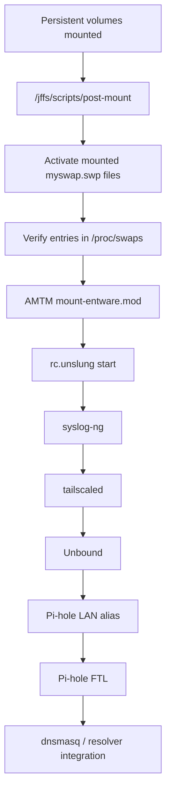

# Swap and Memory Reliability — ASUS TUF-AX5400

**Status:** current reference documentation  
**Reference date:** 2026-09-28  
**Reference platform:** ASUS TUF-AX5400 / GNUton Asuswrt-Merlin `3004.388.11_1-gnuton1_tuf`

## Purpose

This document centralizes the reference router's swap, memory-pressure and startup-order design.

The goal is not to present swap as a substitute for RAM. The goal is to make startup and recovery behavior deterministic on a 512 MiB embedded router that also runs an Entware service stack including Tailscale, Unbound, Pi-hole FTL and syslog-ng.

The current design was shaped by two real boot-time memory incidents:

1. a transient dnsmasq `Cannot allocate memory` event exposed that Entware services could start before swap became active;
2. a later cleanup regression removed the actual `swapon` action from `post-mount`, leaving both swap files inactive and causing Tailscale's Go runtime to fail with an out-of-memory heap-allocation error.

Both failures were investigated, fixed and revalidated with clean reboots.

## Current memory and swap model

The reference router has 512 MiB of physical RAM.

The persistent storage layout provides two SSD-backed swap files:

- one on the Entware volume;
- one on the ROUTER_DATA volume.

The final 2026-09-28 validation observed approximately **2.5 GiB total active swap capacity**.

Swap is treated as a **reliability reserve**, especially during boot and short memory-pressure spikes. It is not expected to carry the normal steady-state working set of the core services.

Representative post-reboot process state:

| Process | RSS | Process swap |
| --- | ---: | ---: |
| Pi-hole FTL | ~10 MiB | 0 kB |
| Unbound | ~17 MiB | 0 kB |
| tailscaled | ~37 MiB | 0 kB |

The same checkpoint reported approximately **128 MiB MemAvailable**.

These values are point-in-time observations, not hard upper bounds. Database growth, DNS workload, firmware behavior and future package versions may change memory usage.

## Why swap ordering matters

The critical requirement is simple:

> Swap must be active before the Entware startup path launches memory-sensitive services.

The reference boot dependency is:



The ordering is important because AMTM's Entware startup is synchronous. If `post-mount` sources the Entware startup path first and reaches `swapon` only afterward, services may allocate memory while the router has no swap safety margin.

## Incident 1 — startup-order weakness and dnsmasq ENOMEM

During the acceptance work for issue #66, an earlier reboot produced:

```text
cannot fork into background: Cannot allocate memory
```

The router eventually recovered, but the reboot was not accepted as a clean startup cycle.

Inspection showed the old ordering:

1. `post-mount` sourced AMTM's `mount-entware.mod`;
2. `mount-entware.mod` started Entware through `rc.unslung`;
3. Entware launched services including syslog-ng, Tailscale and Unbound;
4. Unbound and AMTM-related logic could also trigger dnsmasq restarts;
5. the AMTM-added `swapon` line was reached only after the synchronous Entware startup returned.

This did not prove that missing swap was the only possible contributor to the dnsmasq ENOMEM event, but it exposed a concrete boot-order defect that matched the failure window.

### First remediation

The live reference `/jffs/scripts/post-mount` was changed so the mounted volume's `myswap.swp` became active **before** sourcing `mount-entware.mod`.

The change also added verification through `/proc/swaps` and preserved the existing AMTM behavior.

After that correction, the acceptance counter was reset.

### Validation

Three clean startup cycles were then completed under the corrected configuration.

All three confirmed:

- both persistent filesystems mounted read/write;
- both swap files active before Entware service startup;
- tailscaled, Unbound, dnsmasq and syslog-ng healthy;
- project firewall chains loaded correctly;
- project health check: 0 failures / 0 warnings;
- no matching OOM, filesystem-I/O, read-only-filesystem, panic or similar targeted errors.

Result: **3/3 clean startup cycles passed**.

## Incident 2 — lost swapon action during Pi-hole cleanup

During the 2026-09-28 Pi-hole migration and cleanup, a later revision of `post-mount` retained swap-state checking but had lost the actual `swapon` action.

After reboot:

- both swap files still existed on SSD;
- `/proc/swaps` was empty;
- Tailscale did not become ready;
- invoking the Tailscale client exposed a Go runtime out-of-memory heap-allocation failure.

This was an important distinction: the storage was healthy and the swap files were present, but the operating system had not activated them.

### Recovery

Both existing swap files were activated manually with `swapon`.

Tailscale then started normally.

### Persistent fix

The live reference `post-mount` was corrected again so that it explicitly activates the `myswap.swp` file for each mounted data volume before the AMTM Entware startup path.

The next clean reboot confirmed:

- both swap files active automatically;
- approximately 2.5 GiB total swap available;
- Entware mounted;
- tailscaled started automatically;
- `tailscale0` returned;
- Pi-hole LAN alias returned;
- Pi-hole FTL started;
- Unbound started;
- the main-LAN DHCP DNS policy remained correct;
- normal DNS resolution worked;
- the known block test worked;
- DNSSEC negative validation returned the expected `SERVFAIL`;
- reverse DNS worked for an active DHCP lease.

## Steady-state interpretation

The existence of 2.5 GiB of swap does **not** mean the router normally needs gigabytes of virtual memory.

The final post-reboot checkpoint showed:

- Pi-hole FTL: 0 kB process swap;
- Unbound: 0 kB process swap;
- tailscaled: 0 kB process swap;
- approximately 128 MiB MemAvailable.

The operational interpretation is therefore:

- physical RAM carries the normal service working set;
- SSD-backed swap provides additional resilience during boot and short-lived pressure;
- the corrected boot order ensures the reserve exists before the heaviest Entware services start.

This is preferable to allowing a low-memory startup race to decide whether key services survive a reboot.

## Current ownership boundary

The pre-Entware swap activation logic is part of the **validated live reference configuration** in `/jffs/scripts/post-mount`.

It is important to note that this hook is not currently fully owned or installed by the repository's `services-start` logic. AMTM also participates in this startup path.

That means an AMTM change, reinstall, generated-hook rewrite or manual edit can alter the ordering again.

The repository-managed `services-start` path therefore remains a second safety layer: when it needs to recover Tailscale, it checks the required swap state before launching the daemon.

## Operational checks

After a reboot or maintenance operation, the minimum memory/swap verification is:

```sh
echo "=== MEMORY ==="
grep -E '^(MemTotal|MemFree|MemAvailable|Buffers|Cached|SwapTotal|SwapFree):' /proc/meminfo

echo
echo "=== ACTIVE SWAP ==="
cat /proc/swaps

echo
echo "=== CORE SERVICES ==="
ps | grep -E '[t]ailscaled|[u]nbound|[p]ihole-FTL|[s]yslog-ng'
```

The expected outcome is:

- the configured `myswap.swp` files are listed in `/proc/swaps`;
- Tailscale, Unbound and Pi-hole are running;
- available RAM is not under sustained critical pressure;
- swap use by individual core services is normally low or zero in the validated steady-state baseline.

For startup troubleshooting, also inspect the current boot log for:

```sh
logread | grep -Ei 'swap|out of memory|cannot allocate memory|oom|tailscale|unbound|pihole|dnsmasq'
```

## Maintenance checklist

Any change to AMTM, Entware, storage hooks or boot scripts should be treated as a startup-order change until proven otherwise.

Recommended post-change checks:

1. syntax-check the modified shell hook;
2. confirm both persistent volumes mount successfully;
3. confirm swap activates before Entware startup;
4. reboot cleanly;
5. verify `/proc/swaps`;
6. verify Tailscale, Unbound, Pi-hole, dnsmasq and syslog-ng;
7. run the project health check;
8. scan the current boot for OOM / ENOMEM / filesystem errors;
9. repeat reboot validation when the startup path itself changed.

A configuration should not be considered persistent merely because it works after a manual `swapon` or service restart.

## Security and reliability considerations

SSD-backed swap improves availability but creates its own operational considerations:

- swap may contain fragments of process memory, so the storage device is part of the security boundary;
- persistent storage failure can remove the swap safety margin as well as Entware services;
- excessive sustained swapping would indicate that the workload has outgrown the platform and should not be hidden by simply increasing swap;
- swap does not replace monitoring of `MemAvailable`, service RSS and OOM events.

The current design is acceptable because the validated steady-state services were not actively using swap at the final checkpoint. The swap layer is primarily a startup and pressure-safety mechanism.

## Evidence and traceability

Primary evidence:

- [Issue #66 — clean startup and persistence evidence](../evidence/2026-09-27/issue-66-clean-startup-persistence-evidence.md)
- [Pi-hole main-LAN cutover and final reboot validation](../evidence/2026-09-28/pi-hole-main-lan-cutover-validation.md)

Related architecture and case-study documentation:

- [Boot and Service Dependency Flow](architecture/boot-service-dependency-flow.md)
- [Diversion to Pi-hole on-router migration](pi-hole-on-router-case-study.md)
- [Project status](../PROJECT-STATUS.md)

## Current conclusion

The reference router now has a documented and validated memory-reliability model:

- 512 MiB physical RAM;
- approximately 2.5 GiB SSD-backed swap reserve;
- swap activation before Entware service startup;
- explicit validation of the boot order;
- three clean startup cycles after the first ordering fix;
- a second real regression caught during Pi-hole migration;
- explicit repair and successful clean-reboot validation;
- no core-service swap use in the final steady-state checkpoint.

The most important lesson from this work is not simply that “swap is enabled.” The project now demonstrates that **startup ordering is an architectural dependency** and that persistence must be validated after every boot-path change.
